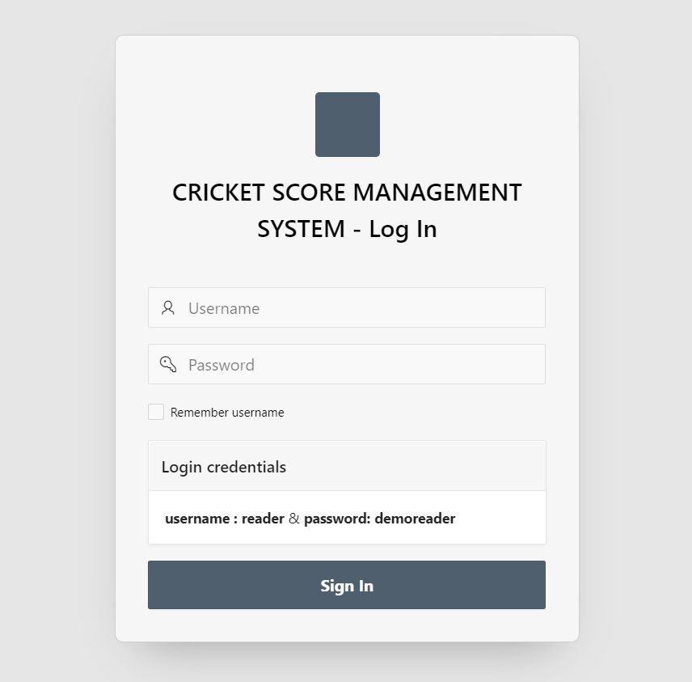

# Project

1. [Queue Management Project by C++](https://github.com/mdadul/project#1-queue-management-project)
2. [Student Management Project by C programming](https://github.com/mdadul/project#2-student-management-system---c-programming)
3. [Student management Project by C++](https://github.com/mdadul/project#3-student-management-system---c) 
4. [Book Shop management project by java](https://github.com/mdadul/project#4-book-shop-management-system---java)
5. [Simple Chatty Bot - Golang](https://github.com/mdadul/project#5-simple-chatty-bot---golang)
6. [Cricket Score Management System - Oracle Apex](https://github.com/mdadul/project#6-cricket-score-management-system-project---oracle-apex)
7. [In-memory Notepad CLI- Golang]()

# 1. [Queue Management Project](https://github.com/mdadul/project/blob/main/Queue_management.cpp)
* Feature
  1. Add
  2. Remove 
  3. Print

* Learning Outcome 
  1. Class
  2. Object
  3. Generic Class
  4. Operator Overloading 

## 2. [Student Management system - C Programming](https://github.com/mdadul/project/blob/main/StudentManagementSystem.c)

* Features
  1. Show Records
  2. Add Records 
  3. Update Records 
  4. Delete Records
  5. Specific info save in new file 
  6. Recycle Bin 
  7. Sort 

* Learning Outcome 
  1. File
  2. Pointer
  3. Structure 

## 3. [Student Management system - C++](https://github.com/mdadul/project/blob/main/StudentManagementSystem.cpp)
* Features 
  1. Show data 
  2. Add data 
  3. Edit 
  4. Delete

## 4. [Book shop management system - Java](https://github.com/mdadul/project/blob/main/BookShop_Management_System.java)
* Feature 
  1. Add book
  2. Update Book
  3. Delete Book
  4. Search Book
  5. Show all book

* Learning Outcome 
  * Java Basics( Array,Loop,String)
  * Class 
  * Handle array of objects 
## 5. [Simple Chatty BOT - GoLang](https://github.com/mdadul/project/blob/main/SimpleChattyBot.go)
* Feature
  1. Guess Age
  2. Count
  3. Question ans check

## 6. [Cricket Score Management System Project - Oracle Apex](https://github.com/mdadul/project/blob/main/CSMS.sql)
----------------------
I have developed an application by oracle apex. 

The application entitled "CRICKET SCORE MANAGEMENTSYSTEM " which is utilized by the user with an update of the cricket even when the user is not watching the match.Each and every match details such as the description about the team and team members will be stored in the database. Each and every match can be updated lively. As soon as someone checks the scoreboard, details of a particular player can be viewed by his id. This project aims to make a cricket score board that will update the scores of a  match.

## Basic Features
* Player Details 
* Match Details
* Team Details
* Venue Details
* Score (Batting , Bowling , Fall of wickets)
* Coach Details 

#### *To see the application as a reader just log in.*

### Log in credential:
---------------------

**Username**  : Reader 

**Password**   : demoreader
-----------------------
**Application link:**
 https://lnkd.in/de6DSwac
 
**Preview (Video)**
[Video](https://youtu.be/aj18lrhzzYo)

**Screenshot**

## 7. [In-memory Notepad CLI - Golang]()
A simple in-memory database that supports CRUD operations. 
* Learning Outcome
   * slices
   * loops
   * string formatting
   * standard IO 
   * and the bufio scanner.
